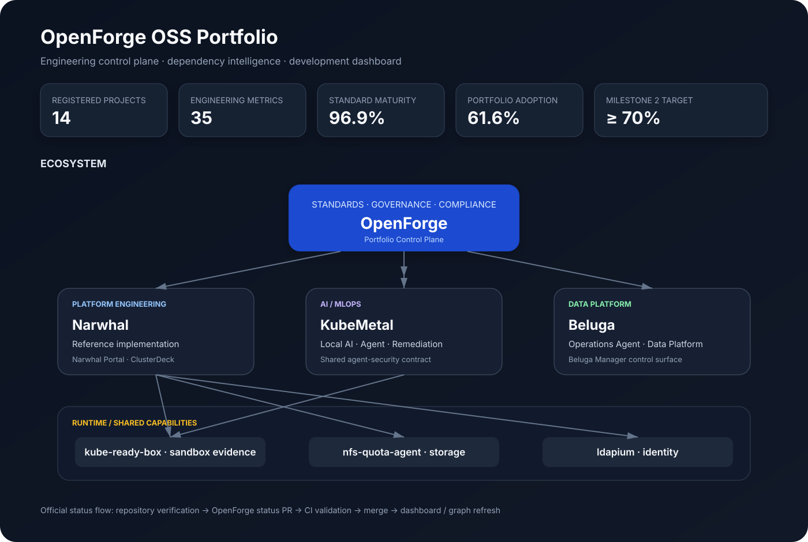

# OpenForge OSS 포트폴리오

[English](PORTFOLIO.md)



OpenForge는 여러 OSS의 공통 Engineering State, 표준 적용, 의존 관계, 변경 영향도와 Evidence 기반 진행 상태를 포트폴리오 단위로 관리합니다.

## 주요 화면

- [개발 현황판](docs/portfolio-dashboard.md)
- [Ecosystem Architecture](docs/portfolio-architecture.md)
- [Dependency & Impact Intelligence](docs/portfolio-impact.md)
- [Portfolio Governance / Status PR Workflow](docs/portfolio-governance-ko.md)

## Canonical Data

- [`portfolio/projects.json`](portfolio/projects.json)
- [`portfolio/relationships.json`](portfolio/relationships.json)
- [`portfolio/milestones.json`](portfolio/milestones.json)
- [`portfolio/status.schema.json`](portfolio/status.schema.json)

## 운영 원칙

```text
각 OSS 구현
    ↓
Repository별 검증
    ↓
Status Publication Payload
    ↓
OpenForge Pull Request
    ↓
OpenForge CI / Impact Review
    ↓
Merge = 공식 Portfolio State 변경
    ↓
Dashboard / Graph / Infographic 갱신
```

단순히 코드가 merge되었다는 이유만으로 Cross-project capability가 완료되었다고 판단하지 않습니다. 해당 OSS가 구현과 검증 Evidence를 기반으로 상태 변경을 게시해야 합니다.
