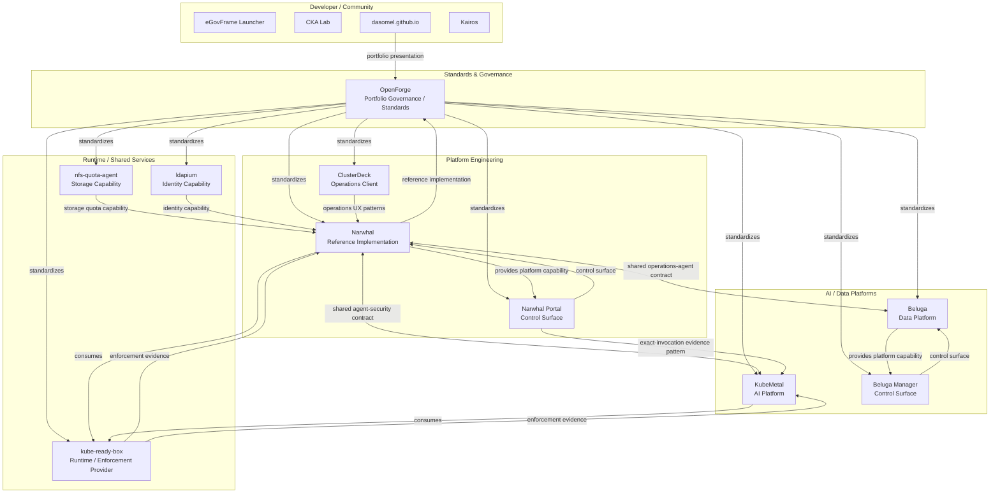

# OpenForge OSS Portfolio Architecture

> The graph is derived from `portfolio/projects.json` and `portfolio/relationships.json`. Edges express engineering influence/integration, not necessarily build-time dependency.

## Ecosystem map



## Portfolio layers

```text
Layer 1  Governance / Standards
         OpenForge
             │
Layer 2  Platform / AI / Data control planes
         Narwhal · KubeMetal · Beluga
             │
Layer 3  Control surfaces
         Narwhal Portal · Beluga Manager · ClusterDeck
             │
Layer 4  Runtime / shared platform capabilities
         kube-ready-box · nfs-quota-agent · ldapium
             │
Layer 5  Developer/community surfaces
         eGovFrame Launcher · CKA Lab · dasomel.github.io · Kairos
```

The layers are conceptual rather than strict runtime tiers. A project may participate in more than one layer.

## Relationship semantics

| Type | Meaning |
|---|---|
| `standardizes` | OpenForge rule/contract is expected to influence the target |
| `reference-implementation` | real project experience feeds reusable OpenForge standards |
| `provides` | source exposes a capability used by the target |
| `consumes` | source integrates or depends on a target capability |
| `control-surface` | source is a user/operations control surface for target |
| `shared-contract` | source and target share a portable contract without requiring a hard runtime dependency |
| `security-impact` | a relationship crosses or influences a trust/authorization boundary |
| `depends-on` | an explicit technical or lifecycle dependency exists |

## Design rule

OpenForge should **describe and validate the relationship**, but should not turn all projects into one tightly coupled monorepo. Each OSS keeps independent release/version ownership and publishes verified state back to OpenForge through a status PR.
