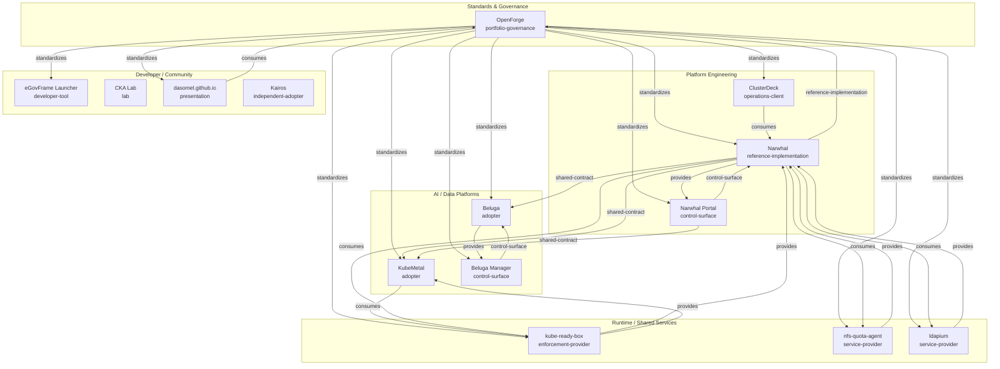

# OpenForge OSS Portfolio Architecture

> Generated from `portfolio/projects.json` and `portfolio/relationships.json`.

## Ecosystem graph

## Relationship semantics

| Type | Meaning |
|---|---|
| `standardizes` | OpenForge rule/contract is expected to influence the target |
| `reference-implementation` | project experience feeds a reusable OpenForge rule |
| `provides` | source exposes a capability consumed by target |
| `consumes` | source depends on or integrates a target capability |
| `control-surface` | source is an operational/user control surface for target |
| `shared-contract` | projects share a portable contract without hard runtime dependency |
| `security-impact` | changes may alter trust or authorization boundaries |

Relationship edges express engineering influence and integration intent, not necessarily build-time package dependencies.
