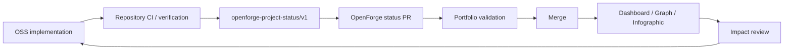
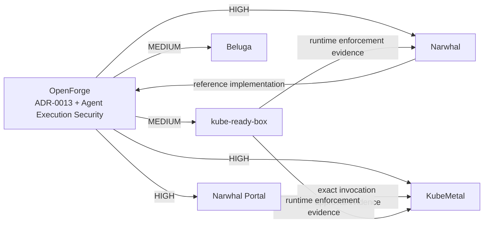

# OpenForge OSS Portfolio Dashboard

> Canonical data lives in `portfolio/*.json`. This dashboard is a portfolio view, not an independent source of truth.

## Portfolio pulse

| Metric | Current | Target / meaning |
|---|---:|---|
| Registered projects | 14 | OpenForge-managed OSS portfolio |
| Engineering metrics | 35 | OpenForge reference metrics |
| Standard maturity | 96.9% | OpenForge standard completeness |
| Portfolio adoption | 61.6% | M2 target: **≥70%** |
| ADRs | 13 | Durable cross-project decisions |

## Development board

| Project | Role | Development | OpenForge adoption | Primary domains |
|---|---|---|---:|---|
| [OpenForge](https://github.com/dasomel/openforge) | portfolio-governance | **active** | — | standards, governance, security, compliance, portfolio |
| [Narwhal](https://github.com/dasomel/narwhal) | reference-implementation | **active** | 81.8% | Kubernetes, platform engineering, GitOps, AI agent |
| [Narwhal Portal](https://github.com/dasomel/narwhal-portal) | control-surface | **active** | 83.8% | portal, Kubernetes, AI agent, operations |
| [KubeMetal](https://github.com/dasomel/kubemetal) | adopter | **active** | 82.4% | Kubernetes, local AI, MLOps, agent, remediation |
| [Beluga](https://github.com/dasomel/beluga) | adopter | **active** | — | Kubernetes, data platform, operations agent |
| [Beluga Manager](https://github.com/dasomel/beluga-manager) | control-surface | **active** | — | data platform, management, UI |
| [kube-ready-box](https://github.com/dasomel/kube-ready-box) | enforcement-provider | **active** | 87.1% | Kubernetes, runtime, sandbox, security, evidence |
| [nfs-quota-agent](https://github.com/dasomel/nfs-quota-agent) | service-provider | **active** | 81.8% | Kubernetes, storage, quota, controller |
| [ldapium](https://github.com/dasomel/ldapium) | service-provider | **active** | 89.7% | identity, LDAP, admin |
| [ClusterDeck](https://github.com/dasomel/clusterdeck) | operations-client | **active** | 82.4% | Kubernetes, desktop, operations, UI |
| [eGovFrame Launcher](https://github.com/dasomel/egovframe-launcher) | developer-tool | **active** | — | developer experience, eGovFrame |
| [CKA Lab](https://github.com/dasomel/cka-lab) | lab | **maintenance** | — | Kubernetes, education, lab |
| [dasomel.github.io](https://github.com/dasomel/dasomel.github.io) | presentation | **active** | — | documentation, community, portfolio |
| [Kairos](https://github.com/dasomel/kairos) | independent-adopter | **maintenance** | — | automation |

`—` means the registry does not currently carry a project-level measured adoption value. It must not be interpreted as 0%.

## Adoption snapshot

```text
ldapium          89.7%  ██████████████████
kube-ready-box   87.1%  █████████████████\innarwhal-portal   83.8%  █████████████████
clusterdeck       82.4%  ████████████████
kubemetal         82.4%  ████████████████
narwhal           81.8%  ████████████████
nfs-quota-agent   81.8%  ████████████████

Portfolio         61.6%  ████████████
M2 target         70.0%  ██████████████
```

## Current milestones

| Milestone | Status | Progress |
|---|---|---|
| Portfolio Adoption M2 | **implementing** | 61.6% / 70.0% |
| Agent Execution Security Rollout | **implementing** | Narwhal Portal, KubeMetal, Beluga, kube-ready-box: design adopted |
| OSS Portfolio Control Plane | **implementing** | OpenForge registry / graph / dashboard / status PR workflow |

## Portfolio operating loop



The portfolio only changes officially after the OpenForge status PR is merged.

## Current Agent Execution Security rollout



## Navigation

- [Portfolio Governance](portfolio-governance.md)
- [Portfolio Architecture](portfolio-architecture.md)
- [Dependency & Impact Intelligence](portfolio-impact.md)
- [`portfolio/projects.json`](../portfolio/projects.json)
- [`portfolio/relationships.json`](../portfolio/relationships.json)
- [`portfolio/milestones.json`](../portfolio/milestones.json)
- [`portfolio/status.schema.json`](../portfolio/status.schema.json)
