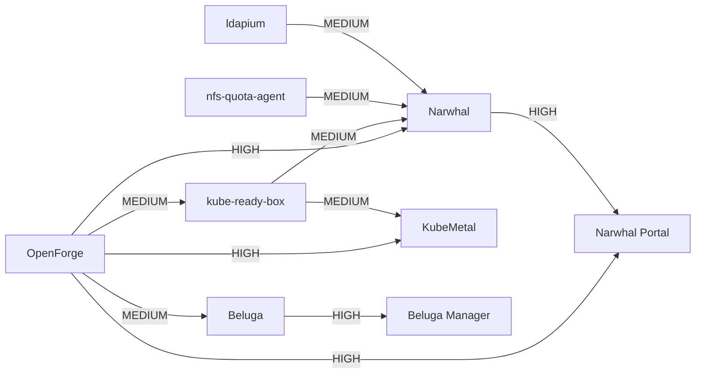
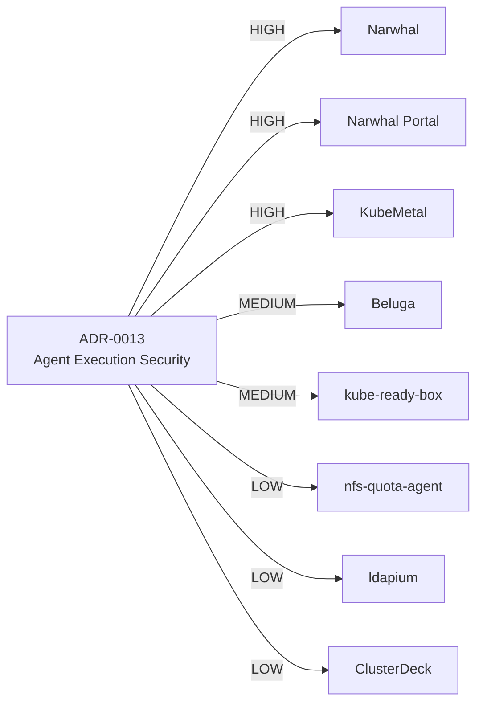

# OpenForge OSS Dependency & Impact Intelligence

Impact is a **coordination/review priority**, not a product quality score.

## Current high-value dependency paths



## ADR-0013 blast radius



## Impact interpretation

| Impact | Expected response |
|---|---|
| **HIGH** | explicit compatibility/design review before or immediately after source change; implementation/adoption issue usually required |
| **MEDIUM** | review affected contract/integration and create follow-up when the changed scope intersects the project |
| **LOW** | advisory review; action only when the concrete changed capability applies |

## Change-impact workflow

```text
OpenForge standard/provider change
            ↓
relationship lookup
            ↓
HIGH targets first
            ↓
MEDIUM / transitive targets
            ↓
repository-specific implementation + verification
            ↓
status PR back to OpenForge
            ↓
official dashboard state updated
```

## Important boundary

OpenForge may identify that a project is affected. It must **not** infer that the downstream implementation is complete merely because the upstream standard or provider changed.

Each repository owns:

- implementation;
- compatibility validation;
- unit/integration/runtime/security evidence;
- release or milestone state.

OpenForge owns:

- cross-project relationship registry;
- impact classification;
- portfolio status review;
- official merged dashboard state;
- presentation/infographic outputs.

## Initial impact priorities

1. **Narwhal / Narwhal Portal** — strongest platform/control-surface coupling and reference implementation feedback loop.
2. **KubeMetal** — strong agent/remediation and runtime-enforcement contract reuse.
3. **Beluga / Beluga Manager** — data-platform operations and control-surface coupling.
4. **kube-ready-box** — shared runtime/sandbox enforcement evidence provider.
5. **nfs-quota-agent / ldapium** — shared storage/identity service capabilities with mutation/security implications.
6. **ClusterDeck and developer/community projects** — UX, operations, documentation or lower-coupling adoption paths.
