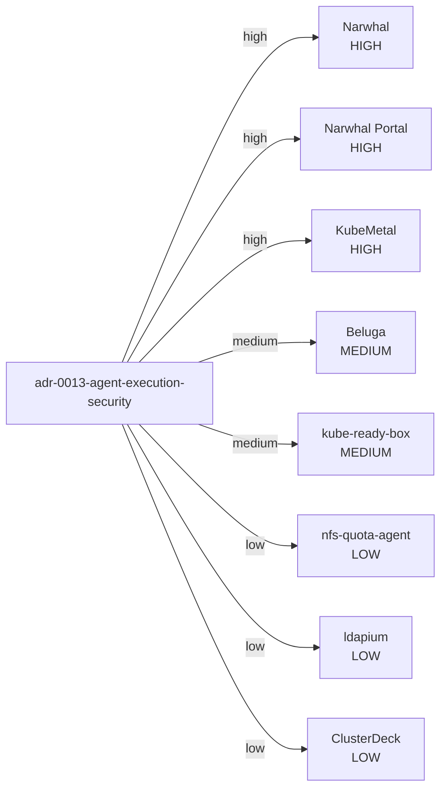

# OpenForge OSS Dependency & Impact Intelligence

> Generated impact view. Scores are graph-weighted coordination indicators, not product quality scores.

## Cross-project influence ranking

| Project | Impact score | Incoming edges | Outgoing edges |
|---|---:|---:|---:|
| Narwhal | 29 | 6 | 7 |
| OpenForge | 27 | 2 | 11 |
| KubeMetal | 11 | 4 | 1 |
| Narwhal Portal | 11 | 2 | 2 |
| Beluga | 10 | 3 | 1 |
| kube-ready-box | 10 | 3 | 2 |
| Beluga Manager | 8 | 2 | 1 |
| ldapium | 6 | 2 | 1 |
| nfs-quota-agent | 6 | 2 | 1 |
| ClusterDeck | 3 | 1 | 1 |
| dasomel.github.io | 2 | 1 | 1 |
| eGovFrame Launcher | 1 | 1 | 0 |
| CKA Lab | 0 | 0 | 0 |
| Kairos | 0 | 0 | 0 |

## Standards blast radius

### `adr-0013-agent-execution-security`

## Change-impact rule

A change to a standard or provider should trigger review of directly related `high` impact projects first, then transitive or `medium` relationships. `low` relationships are advisory unless the changed scope explicitly touches them.

OpenForge does not mark downstream implementation complete automatically. The affected repository owns implementation and verification; completion is published back through a status PR.
