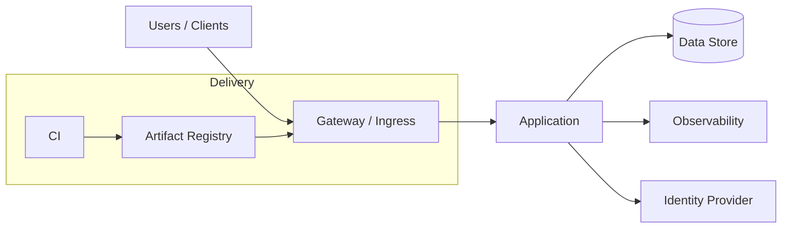

# Architecture Diagram Template

Use Mermaid for diagrams that should remain source-controlled and easy to review.

## Diagram rules

- Start with user-visible boundaries before implementation details.
- Keep one primary diagram per architectural concern.
- Show trust boundaries, external dependencies, persistent state, and control planes when relevant.
- Link implementation details to source files or deployment manifests.
- Prefer Mermaid for editable diagrams; use exported SVG/PNG only as derived artifacts.
